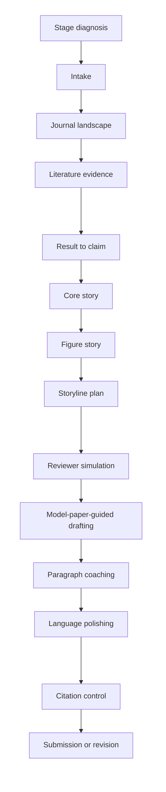

# SCI-paper-skills

[](manifest.yaml)
[](LICENSE)
[](skills)

**Language:** [中文](README.md) | English

`SCI-paper-skills` is a reusable Codex skill pack for SCI/SCIE manuscript writing. It is not a generic polishing template. It is a target-journal-aware workflow that helps researchers move from research results to a submission-ready manuscript by diagnosing the current bottleneck, building the paper story, checking evidence strength, arranging figures, grounding claims in the literature, drafting sections, and preparing submission or revision materials.

> In one sentence: it turns scattered results, figures, drafts, model papers, and reviewer comments into a coherent SCI manuscript with clear logic and defensible claims.

## Contents

- [Who It Is For](#who-it-is-for)
- [Core Capabilities](#core-capabilities)
- [Skill Map](#skill-map)
- [Recommended Workflow](#recommended-workflow)
- [Complete Example](#complete-example)
- [Repository Structure](#repository-structure)
- [Installation and Updates](#installation-and-updates)
- [Design Principles](#design-principles)
- [License](#license)

## Who It Is For

This skill pack is designed for researchers who already have research materials but are unsure how to organize them into a complete manuscript:

| What you already have | What the skills help you produce |
|---|---|
| Data, figures, tables, or statistical results | Defensible claims and an evidence chain |
| A rough draft, Chinese draft, or scattered paragraphs | A target-journal-oriented manuscript structure |
| Target journals or model papers | Journal positioning, article pattern analysis, and fit assessment |
| Reviewer or editor comments | Revision strategy, point-by-point responses, and required materials |
| Uncertain conclusions or mechanistic interpretations | Controlled claim strength, evidence boundaries, and future experiment framing |

## Core Capabilities

- Diagnose where a manuscript project is currently stuck.
- Convert experimental or analytical results into defensible manuscript claims.
- Separate what the results can support from what they cannot yet support.
- Build background, scientific questions, research gaps, and discussion boundaries from the literature.
- Arrange figures and storyline so the Results section becomes an evidence chain instead of a data list.
- Check figures, tables, supplementary materials, legends, titles, and references against target-journal expectations.
- Draft abstracts, introductions, results, discussions, methods, figure legends, cover letters, and revision letters.
- Control claim strength to avoid over-mechanistic, over-novel, or unsupported statements.
- Provide complete English and Chinese manuscript examples with methods, statistics, legends, references, and reproducibility checklists.

## Skill Map

Main orchestrator:

```text
$sci-paper-skills
```

| Stage | Skill | Purpose |
|---:|---|---|
| 0 | `sci-stage-diagnosis` | Identify where the manuscript project is stuck and suggest next actions |
| 1 | `sci-intake-router` | Collect target journal, research area, existing materials, and routing context |
| 2 | `sci-journal-landscape` | Analyze journal positioning, comparable papers, and submission fit |
| 3 | `sci-literature-evidence` | Build literature evidence, research gaps, and support/conflict relationships |
| 4 | `sci-result-to-claim` | Convert results into defensible manuscript claims |
| 5 | `sci-core-story-finder` | Select the central story from multiple possible conclusions |
| 6 | `sci-figure-story-builder` | Arrange figure order, main/supplementary placement, and figure-claim links |
| 7 | `sci-storyline-planner` | Design manuscript structure and Results/Discussion logic |
| 8 | `sci-reviewer-simulator` | Simulate editor and reviewer risks before submission |
| 9 | `sci-draft-mimic` | Draft sections using the structure and rhetorical function of target-journal model papers |
| 10 | `sci-paragraph-coach` | Coach individual paragraphs, figure legends, abstracts, or cover-letter passages |
| 11 | `sci-language-polisher` | Polish English or Chinese expression without changing scientific meaning |
| 12 | `sci-citation-control` | Check citation placement, reference style, and claim-evidence alignment |
| 13 | `sci-submission-revision` | Prepare submission materials, revision strategy, and point-by-point responses |

## Recommended Workflow



The key idea is not to generate polished text immediately. The workflow first stabilizes the scientific logic: target journal, literature background, result evidence, claim boundaries, figure order, discussion depth, and method reproducibility should all reinforce one another.

## Complete Example

The repository includes a synthetic zero-to-one example showing how a research question can be organized into a real manuscript-style Markdown document:

| File | Description |
|---|---|
| [complete-manuscript.md](examples/zero-to-one-sci-manuscript/complete-manuscript.md) | Complete English manuscript |
| [complete-manuscript.zh-CN.md](examples/zero-to-one-sci-manuscript/complete-manuscript.zh-CN.md) | Complete Chinese manuscript |
| [manuscript-state-example.yaml](examples/manuscript-state-example.yaml) | Example manuscript state file |
| [final-package.md](examples/zero-to-one-sci-manuscript/final-package.md) | Final package notes |

The example manuscript includes an abstract, introduction, results, discussion, materials and methods, data availability, author contributions, figure legends, supplementary tables, and references. It demonstrates four quality gates:

1. The Introduction must be literature-supported and move from background, known mechanisms, and unresolved problems to the scientific question.
2. The Results section must be evidence-centered, with controls, statistics, replication, figure calls, and necessary transition sentences.
3. The Discussion must start from the results and expand to existing literature, mechanistic possibilities, alternative explanations, limitations, and future experiments.
4. Materials and Methods must be reproducible enough to describe materials, treatments, instruments/software, replication, exclusion rules, quantification, and statistical models.

## Repository Structure

```text
skills/      # Installable skill modules
examples/    # Complete zero-to-one manuscript examples
docs/        # Workflow, design principles, and skill index
scripts/     # Sync and validation scripts
manifest.yaml
CHANGELOG.md
LICENSE
```

Each skill is an independent directory with these core files:

```text
SKILL.md
agents/openai.yaml
references/
```

## Installation and Updates

Clone the repository, then run the sync script to copy the complete skill directories under `skills/` into your local skills directory:

```bash
git clone https://github.com/Vonfre/SCI-paper-skills.git
cd SCI-paper-skills
bash scripts/sync_codex_skills.sh
```

If your tool uses a custom skills directory, pass the target directory through the script argument or the supported environment variable. Keep each full skill folder intact; do not copy only a single `SKILL.md` file.

Optional: after syncing, run the validation script to check that the skill directories and index remain complete.

```bash
bash scripts/validate_skill_pack.sh
```

## Design Principles

- Diagnose first, then write.
- Evidence first, then claims.
- Structure first, then polishing.
- State only what the evidence can support; handle unsupported points through boundaries and future experiments.
- Do not fabricate data, references, approvals, accession numbers, methods, statistical results, or journal requirements.
- Mimic the structure and rhetorical function of model papers, not distinctive original wording.

## License

This project is open source under the [MIT License](LICENSE).
