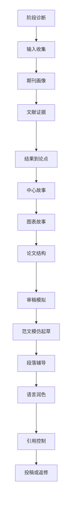

# SCI-paper-skills

[](manifest.yaml)
[](LICENSE)
[](skills)

**Language:** 中文 | [English](README.en.md)

`SCI-paper-skills` 是一套面向 SCI/SCIE 论文写作的可复用 Codex skills。它不是普通润色模板，而是一条从“研究结果”走向“目标期刊论文”的写作工作流：先判断项目卡在哪，再梳理论文故事、证据强度、图表顺序、文献支撑、正文结构和投稿/返修材料。

> 一句话：把零散结果、图表、草稿、范文和审稿意见，整理成逻辑清楚、证据边界明确、接近投稿形态的 SCI manuscript。

## 目录

- [适合谁](#适合谁)
- [核心能力](#核心能力)
- [技能地图](#技能地图)
- [推荐工作流](#推荐工作流)
- [完整示例](#完整示例)
- [仓库结构](#仓库结构)
- [安装与更新](#安装与更新)
- [设计原则](#设计原则)
- [License](#license)

## 适合谁

这套 skills 尤其适合已经有部分科研材料，但不知道如何组织成完整论文的研究者：

| 你手里已有 | 这套 skills 帮你完成 |
|---|---|
| 数据、图表、统计结果 | 转换为可防守的论文论点和证据链 |
| 初稿、中文草稿或零散段落 | 梳理成目标期刊风格的 manuscript 结构 |
| 目标期刊、同类范文 | 分析期刊定位、文章组织方式和投稿匹配度 |
| 审稿意见或编辑意见 | 制定返修策略、逐点回复和材料清单 |
| 不确定的结论或机制解释 | 控制 claim strength，明确证据边界和未来实验 |

## 核心能力

- 从目标期刊和研究内容出发，判断当前论文处于哪个阶段。
- 把实验结果或分析结果转化为可防守的论文论点。
- 区分“结果能证明什么”和“结果还不能证明什么”。
- 根据文献建立背景、科学问题、研究缺口和讨论边界。
- 组织 figure/storyline，让 Results 不只是罗列数据，而是形成证据链。
- 按目标期刊检查图表、附表、补充材料、图注、表题和引用格式。
- 起草摘要、引言、结果、讨论、方法、图注、投稿信和返修信。
- 控制 claim strength，避免过度机制化、过度新颖性或无证据表达。
- 生成中英文完整论文示例，保留方法、统计、图注、参考文献和可复现性清单。

## 技能地图

主控入口：

```text
$sci-paper-skills
```

| 阶段 | Skill | 作用 |
|---:|---|---|
| 0 | `sci-stage-diagnosis` | 判断论文项目卡在哪一步，并给出下一步动作 |
| 1 | `sci-intake-router` | 收集目标期刊、研究方向、已有材料并路由 |
| 2 | `sci-journal-landscape` | 分析目标期刊定位、同类论文和投稿匹配度 |
| 3 | `sci-literature-evidence` | 建立文献证据、研究缺口、支持/冲突关系 |
| 4 | `sci-result-to-claim` | 把结果转换为可防守的论文论点 |
| 5 | `sci-core-story-finder` | 从多个可能结论中确定中心故事 |
| 6 | `sci-figure-story-builder` | 安排图表顺序、主文/补充材料和图-论点关系 |
| 7 | `sci-storyline-planner` | 设计论文结构和 Results/Discussion 逻辑 |
| 8 | `sci-reviewer-simulator` | 模拟编辑和审稿人风险，提前修补弱点 |
| 9 | `sci-draft-mimic` | 参考目标期刊范文的结构和修辞功能起草正文 |
| 10 | `sci-paragraph-coach` | 写单个段落、图注、摘要或 cover letter 片段 |
| 11 | `sci-language-polisher` | 在不改变科学含义的前提下润色中英文表达 |
| 12 | `sci-citation-control` | 检查引用位置、参考文献格式和 claim-evidence 对齐 |
| 13 | `sci-submission-revision` | 准备投稿材料、返修策略和逐点回复 |

## 推荐工作流



这条流程的关键不是“直接生成漂亮文字”，而是先把论文的科学逻辑搭稳：目标期刊、文献背景、结果证据、论点边界、图表顺序、讨论深度和方法可复现性都要彼此咬合。

## 完整示例

仓库提供了一个从 0 到 1 的合成示例，展示如何把一个研究问题组织成真正论文格式的 Markdown：

| 文件 | 内容 |
|---|---|
| [complete-manuscript.md](examples/zero-to-one-sci-manuscript/complete-manuscript.md) | 英文完整论文 |
| [complete-manuscript.zh-CN.md](examples/zero-to-one-sci-manuscript/complete-manuscript.zh-CN.md) | 中文完整论文 |
| [manuscript-state-example.yaml](examples/manuscript-state-example.yaml) | 示例状态文件 |
| [final-package.md](examples/zero-to-one-sci-manuscript/final-package.md) | 最终打包说明 |

示例论文包含摘要、引言、结果、讨论、材料与方法、数据可用性、作者贡献、图注、补充表和参考文献。它重点展示四个质量门槛：

1. 引言必须由文献支撑，从背景、已知机制、未解决问题推进到科学问题。
2. 结果必须以证据为核心，包含对照、统计、重复、图表引用和必要的过渡句。
3. 讨论必须从结果出发，扩展到既有文献、机制可能性、替代解释、局限和未来实验。
4. 材料与方法必须足够可复现，说明材料、处理、仪器/软件、重复、排除规则、定量和统计模型。

## 仓库结构

```text
skills/      # 可安装的 skill 模块
examples/    # 从 0 到 1 的完整论文示例
docs/        # 工作流、设计原则和技能索引
scripts/     # 同步和校验脚本
manifest.yaml
CHANGELOG.md
LICENSE
```

每个 skill 都是独立目录，核心文件为：

```text
SKILL.md
agents/openai.yaml
references/
```

## 安装与更新

将仓库克隆到本地后，运行同步脚本即可把 `skills/` 下的完整技能目录复制到本地 skills 目录：

```bash
git clone https://github.com/Vonfre/SCI-paper-skills.git
cd SCI-paper-skills
bash scripts/sync_codex_skills.sh
```

如果你的工具使用自定义 skills 目录，可以用脚本参数或环境变量指定目标目录。同步时请保留完整 skill 文件夹，不要只复制单个 `SKILL.md`。

可选：同步后运行校验脚本，确认 skill 目录和索引仍然完整。

```bash
bash scripts/validate_skill_pack.sh
```

## 设计原则

- 先诊断，再写作。
- 先证据，再论点。
- 先结构，再润色。
- 能证明什么就写什么，不能证明的内容用边界和未来实验处理。
- 不编造数据、参考文献、审批信息、登录号、方法、统计结果或期刊要求。
- 模仿范文的结构和功能，不复制有辨识度的原文表达。

## License

本项目基于 [MIT License](LICENSE) 开源。
